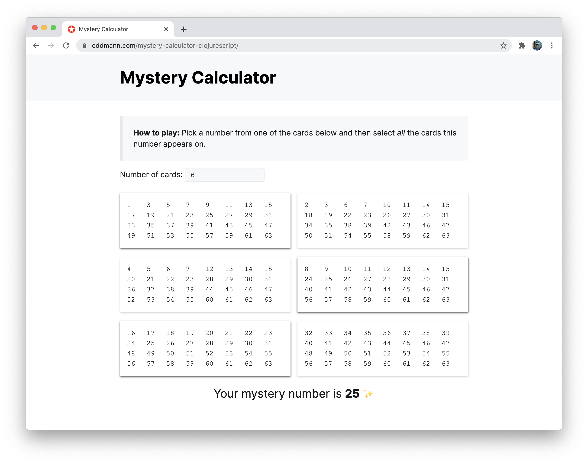

# Mystery Calculator

_ClojureScript, Reagent and GitHub Pages_

Demo: [https://eddmann.com/mystery-calculator-clojurescript/](https://eddmann.com/mystery-calculator-clojurescript/) 
Article: [https://eddmann.com/posts/the-mystery-calculator-in-clojurescript-and-reagent/](https://eddmann.com/posts/the-mystery-calculator-in-clojurescript-and-reagent/)

## Instructions

The complete set consists of `N` cards, printed with a series of numbers, show all the cards to a friend and ask him or her to select-one number from any one card.
Show the other `N-1` cards to your friend asking him or her to say whether the number appears on these cards.
Take all the cards on which your friend says the number appears, add together the top left hand corner number of each card and the total is the number your friend selected.
